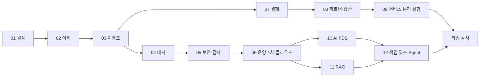

# 6개월 AI 금융 백엔드 마스터플랜

## 목표

하나의 금융 플랫폼을 12개의 2주 프로젝트로 진화시키며, 1~3년차 Java/Spring 금융 백엔드 포지션에서 요구하는 정합성, 장애 대응, 운영 관측성, 금융 AI 통제 역량을 검증 가능한 증거로 남깁니다.

성공은 기능 개수로 판단하지 않습니다. 다음 네 질문에 코드·테스트·원본 측정치로 답할 수 있어야 합니다.

1. 돈이 중복 생성·소멸되지 않는가?
2. 재시도와 장애 후에도 같은 비즈니스 결과에 도달하는가?
3. 제시한 성능·AI 품질 수치를 같은 조건에서 재현할 수 있는가?
4. AI의 권한과 사람의 책임 경계가 시스템에 강제되어 있는가?

## 범위

### 포함

- 복식부기 원장, 계좌이체, 이벤트 전달, 대사, 결제, 정산
- 인증·인가, 개인정보 보호, 감사 추적
- 관측성, 부하·장애 실험, 임시 AWS 배포
- 합성 데이터 기반 이상거래 탐지
- 출처 기반 RAG, 모델 라우팅, 승인 기반 Agent
- 프로젝트별 채용 리뷰와 적대적 레드팀 검증

### 제외

- 실거래·실고객 데이터 및 실제 금융기관 연동
- 투자 추천, 신용 승인, 자동 자금 이동
- 금융 규제 인증 또는 운영 SLA 주장
- 전체 시스템을 Kubernetes로 운영하는 것
- 12개 회차를 각각 독립 서비스나 독립 제품으로 포장하는 것

## 일정과 상태

| ID    | 기간               | 프로젝트                      | 의존성         | 상태    | 계획                                             | 종료 기준                                                 |
| ----- | ------------------ | ----------------------------- | -------------- | ------- | ------------------------------------------------ | --------------------------------------------------------- |
| 01    | 2026-08-31 ~ 09-13 | 복식부기 원장                 | 없음           | PLANNED | [PLAN](projects/01-ledger-core/PLAN.md)          | [EXIT](projects/01-ledger-core/EXIT_CRITERIA.md)          |
| 02    | 09-14 ~ 09-27      | 계좌이체와 동시성             | 01             | PLANNED | [PLAN](projects/02-transfer-concurrency/PLAN.md) | [EXIT](projects/02-transfer-concurrency/EXIT_CRITERIA.md) |
| 03    | 09-28 ~ 10-11      | 신뢰 가능한 이벤트 처리       | 01, 02         | PLANNED | [PLAN](projects/03-reliable-events/PLAN.md)      | [EXIT](projects/03-reliable-events/EXIT_CRITERIA.md)      |
| 04    | 10-12 ~ 10-25      | 대사와 재시작 가능한 배치     | 01, 03         | PLANNED | [PLAN](projects/04-reconciliation-batch/PLAN.md) | [EXIT](projects/04-reconciliation-batch/EXIT_CRITERIA.md) |
| 05    | 10-26 ~ 11-08      | 보안·권한·감사                | 01~04          | PLANNED | [PLAN](projects/05-security-audit/PLAN.md)       | [EXIT](projects/05-security-audit/EXIT_CRITERIA.md)       |
| 06    | 11-09 ~ 11-22      | 관측성·장애 대응·1차 클라우드 | 01~05          | PLANNED | [PLAN](projects/06-operability-cloud/PLAN.md)    | [EXIT](projects/06-operability-cloud/EXIT_CRITERIA.md)    |
| 07    | 11-23 ~ 12-06      | 결제 상태 머신                | 01~03, 05      | PLANNED | [PLAN](projects/07-payment-lifecycle/PLAN.md)    | [EXIT](projects/07-payment-lifecycle/EXIT_CRITERIA.md)    |
| 08    | 12-07 ~ 12-20      | 외부 파트너·웹훅·정산         | 03, 04, 07     | PLANNED | [PLAN](projects/08-partner-settlement/PLAN.md)   | [EXIT](projects/08-partner-settlement/EXIT_CRITERIA.md)   |
| 09    | 12-21 ~ 2027-01-03 | 결제 서비스 분리 실험         | 03, 06~08      | PLANNED | [PLAN](projects/09-service-extraction/PLAN.md)   | [EXIT](projects/09-service-extraction/EXIT_CRITERIA.md)   |
| 10    | 01-04 ~ 01-17      | AI 이상거래 탐지              | 02, 03, 05, 06 | PLANNED | [PLAN](projects/10-fraud-detection/PLAN.md)      | [EXIT](projects/10-fraud-detection/EXIT_CRITERIA.md)      |
| 11    | 01-18 ~ 01-31      | 금융 RAG와 모델 라우팅        | 05, 06         | PLANNED | [PLAN](projects/11-financial-rag/PLAN.md)        | [EXIT](projects/11-financial-rag/EXIT_CRITERIA.md)        |
| 12    | 02-01 ~ 02-14      | 책임 있는 금융 Agent          | 05, 07, 10, 11 | PLANNED | [PLAN](projects/12-responsible-agent/PLAN.md)    | [EXIT](projects/12-responsible-agent/EXIT_CRITERIA.md)    |
| Audit | 02-15 ~ 02-28      | 2차 클라우드·전체 감사        | 01~12          | PLANNED | [FINAL_AUDIT_PLAN](reviews/FINAL_AUDIT_PLAN.md)  | 전체 🔴 0건                                               |

## 의존성 흐름

## 2주 운영 리듬

| 일차 | 작업                               | 종료 산출물                |
| ---- | ---------------------------------- | -------------------------- |
| 1    | 금융 문제·불변식·비범위 확정       | 문제 정의, 유비쿼터스 언어 |
| 2    | 기준선·설계 후보·측정법 확정       | ADR 초안, 실험 프로토콜    |
| 3~7  | 수직 기능 구현과 자동화 테스트     | 실행 가능한 기능, 테스트   |
| 8    | 실패·동시성·성능 또는 AI 품질 검증 | 원본 로그·지표·실패 기록   |
| 9    | 다이어그램·결과·한계 문서화        | 증거 manifest, 결과 초안   |
| 10   | 두 포트폴리오 스킬 평가와 보정     | 리뷰 2종, RELEASED/HOLD    |

### 일정 보호 규칙

- 필수 범위와 확장 범위를 분리하며, 확장 범위는 종료 게이트에 영향을 주지 않습니다.
- 🔴 결함이나 금융 불변식 실패가 있으면 다음 회차의 첫날을 수정에 사용합니다.
- 수정이 하루를 넘으면 다음 회차 확장 범위를 제거하고 문제를 숨기지 않습니다.
- 의존 프로젝트가 HOLD이면 그 결과를 소비하는 기능은 시작하지 않고 독립 작업만 진행합니다.
- 2026-12-21 ~ 2027-01-03 회차는 연말 일정 위험 때문에 새 인프라를 늘리지 않고 기존 결제 경계의 분리 실험에만 집중합니다.

## 두 차례 클라우드 쇼케이스

### 1차: 프로젝트 06

- 원장·이체·이벤트·대사·보안을 단일 배포 단위로 AWS ECS/RDS에 임시 배포
- 최소 관리자 UI, Grafana 대시보드, 세 가지 장애 시나리오 시연
- 배포 시간, 테스트 환경, AWS 비용, 제거 확인을 증거로 보관
- 고가용성이나 실제 운영 경험으로 표현하지 않음

### 2차: 최종 감사

- 결제, FDS, RAG, 승인 기반 Agent를 포함한 통합 시나리오 배포
- 공개 데모 데이터만 사용하고 AI 변경 작업은 승인 전까지 비영속 제안으로 유지
- 전체 수치와 캡처를 다시 생성하고 1차 쇼케이스 숫자를 재사용하지 않음
- 증거 수집 후 Terraform으로 리소스를 제거하고 비용 명세를 보관

## Git 시점 보존

- 프로젝트 태그: `p01-ledger-core` ~ `p12-responsible-agent`
- 쇼케이스 태그: `showcase-01-core-banking`, `showcase-02-ai-finance`
- 태그는 `RELEASED` 판정 뒤에만 생성합니다.
- HOLD 상태는 태그 대신 이슈와 수정 commit으로 기록합니다.
- 태그 설명에는 테스트 명령, evidence 경로, 리뷰 문서 링크를 포함합니다.

## 채용용 최종 구성

최종 README·이력서·포트폴리오에서는 다음 네 사례만 본문에 둡니다.

1. 원장과 이체의 정합성
2. 결제 장애와 서비스 경계의 트레이드오프
3. 합성 데이터라는 한계를 명시한 AI FDS
4. RAG 근거와 승인 경계를 갖춘 금융 Agent

12개 전체 과정은 `문제 난이도가 어떻게 증가했는가`를 보여주는 타임라인으로 연결하며, 사용 기술의 개수를 성과로 제시하지 않습니다.

## 최종 성공 조건

- 12개 프로젝트 모두 종료 평가 문서가 존재합니다.
- 대표 주장과 수치가 원본 증거로 역추적됩니다.
- 공개 문서의 🔴 정합성·과장 결함이 0건입니다.
- 네 대표 사례가 문제, 대안, 선택, 비용, 검증, 한계를 각각 설명합니다.
- 실제 운영·실사용자·규제 인증으로 오해될 표현이 없습니다.
