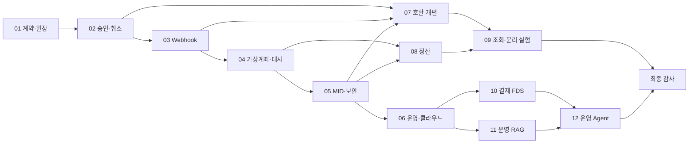

# 6개월 토스페이먼츠 공개 계약 기반 PG 샌드박스 마스터플랜

## 목표

토스페이먼츠 V2 공개 문서를 외부 계약으로 삼아 **가맹점이 연동할 수 있는 학습용 PG 샌드박스**를 12개의 2주 프로젝트로 진화시킵니다. 선정한 승인·조회·취소·가상계좌·webhook 계약은 경로, 헤더, 요청·응답, 상태와 오류 의미를 자동화 계약 테스트로 추적합니다.

이 프로젝트는 토스페이먼츠 내부 시스템을 복제하지 않습니다. 실제 카드사·은행 대신 결정론적 sandbox control API를 사용하고, 공개되지 않은 원장·DB·이벤트·인프라는 프로젝트 결정으로 설계합니다.

근거와 계약:

- [제품 정의와 모방 경계](docs/PRODUCT_VISION.md)
- [토스페이먼츠 근거 지도](docs/TOSS_PAYMENTS_EVIDENCE_MAP.md)
- [선정 계약 매트릭스](docs/TOSS_PAYMENTS_CONTRACT_MATRIX.md)
- [도메인 지식 학습 규칙](docs/DOMAIN_STUDY_PLAYBOOK.md)

성공은 기능 수가 아니라 다음 질문으로 판단합니다.

1. 공개 계약의 선정 행을 재현 가능한 contract test로 검증했는가?
2. 중복·동시 요청과 외부 응답 유실에도 결제와 원장 결과가 한 번만 확정되는가?
3. webhook·가상계좌·정산처럼 늦게 도착하는 사실을 추적하고 복구할 수 있는가?
4. 기존 가맹점 계약을 유지하면서 내부 구조를 점진적으로 교체하고 롤백할 수 있는가?
5. AI가 결제 변경 권한을 갖지 않고 사람의 승인 경계가 시스템에 강제되는가?

## 호환 범위

### 선정한 공개 계약

- `POST /v1/payments/confirm`
- `GET /v1/payments/{paymentKey}`
- `GET /v1/payments/orders/{orderId}`
- `POST /v1/payments/{paymentKey}/cancel`
- `POST /v1/virtual-accounts`
- `PAYMENT_STATUS_CHANGED`, `CANCEL_STATUS_CHANGED`, `DEPOSIT_CALLBACK`
- Payment·Cancel·Error 객체, Basic 인증, `Idempotency-Key`, API 버전 규칙
- 합성 KRW 카드·간편결제·가상계좌 시나리오

선정 계약의 공통 시나리오는 엄격 호환 대상으로 삼습니다. 세금·해외통화·에스크로처럼 제외한 선택 기능은 조용히 무시하지 않고 매트릭스에서 `unsupported`로 관리합니다.

### 샌드박스 전용 표면

`/sandbox/**`는 합성 인증, 가상계좌 입금, 승인 거절, timeout, 응답 유실과 webhook 실패를 결정론적으로 발생시킵니다. test·local demo profile에서만 활성화하고 토스페이먼츠 호환 API로 표현하지 않습니다.

최소 샘플 상점은 주문 생성, 승인 전 `orderId`·금액 대조, 결제 승인, 결과 조회와 webhook 수신을 보여줍니다. 토스 브랜드·문구·결제창 UI는 복제하지 않습니다.

### 비범위

- 빌링, 브랜드페이, 링크페이, 지급대행, 해외결제
- 실제 카드번호·계좌번호·API credential과 실거래
- 실제 카드망 전문, 가맹점 계약, 세금 신고와 규제 인증
- 토스페이먼츠 비공개 내부 구조·조직·규모의 재현
- 레거시 아티클의 운영 수치를 프로젝트 성과로 재사용

## 일정과 상태

| ID | 기간 | 프로젝트 | 의존성 | 상태 | 계획 | 종료 기준 |
| --- | --- | --- | --- | --- | --- | --- |
| 01 | 2026-08-31 ~ 09-13 | 결제 계약과 불변 결제 원장 | 없음 | PLANNED | [PLAN](projects/01-ledger-core/PLAN.md) | [EXIT](projects/01-ledger-core/EXIT_CRITERIA.md) |
| 02 | 09-14 ~ 09-27 | 승인·조회·취소와 멱등성 | 01 | PLANNED | [PLAN](projects/02-payment-command-concurrency/PLAN.md) | [EXIT](projects/02-payment-command-concurrency/EXIT_CRITERIA.md) |
| 03 | 09-28 ~ 10-11 | 신뢰 가능한 webhook | 01, 02 | PLANNED | [PLAN](projects/03-reliable-webhooks/PLAN.md) | [EXIT](projects/03-reliable-webhooks/EXIT_CRITERIA.md) |
| 04 | 10-12 ~ 10-25 | 가상계좌와 비동기 대사 | 01~03 | PLANNED | [PLAN](projects/04-virtual-account-reconciliation/PLAN.md) | [EXIT](projects/04-virtual-account-reconciliation/EXIT_CRITERIA.md) |
| 05 | 10-26 ~ 11-08 | MID·API 키·버전·보안·감사 | 01~04 | PLANNED | [PLAN](projects/05-merchant-api-security/PLAN.md) | [EXIT](projects/05-merchant-api-security/EXIT_CRITERIA.md) |
| 06 | 11-09 ~ 11-22 | 관측성·장애 대응·1차 클라우드 | 01~05 | PLANNED | [PLAN](projects/06-operability-cloud/PLAN.md) | [EXIT](projects/06-operability-cloud/EXIT_CRITERIA.md) |
| 07 | 11-23 ~ 12-06 | 하위 호환 API와 점진적 개편 | 02, 03, 05, 06 | PLANNED | [PLAN](projects/07-api-compat-migration/PLAN.md) | [EXIT](projects/07-api-compat-migration/EXIT_CRITERIA.md) |
| 08 | 12-07 ~ 12-20 | 거래 단위 정산 엔진 | 01, 02, 04, 05 | PLANNED | [PLAN](projects/08-settlement-engine/PLAN.md) | [EXIT](projects/08-settlement-engine/EXIT_CRITERIA.md) |
| 09 | 12-21 ~ 2027-01-03 | 결제 조회 모델과 서비스 경계 | 03, 06~08 | PLANNED | [PLAN](projects/09-payment-read-model-extraction/PLAN.md) | [EXIT](projects/09-payment-read-model-extraction/EXIT_CRITERIA.md) |
| 10 | 01-04 ~ 01-17 | AI 결제 이상거래 탐지 | 02, 03, 05, 06 | PLANNED | [PLAN](projects/10-fraud-detection/PLAN.md) | [EXIT](projects/10-fraud-detection/EXIT_CRITERIA.md) |
| 11 | 01-18 ~ 01-31 | 결제 운영 RAG와 모델 라우팅 | 05, 06 | PLANNED | [PLAN](projects/11-payment-ops-rag/PLAN.md) | [EXIT](projects/11-payment-ops-rag/EXIT_CRITERIA.md) |
| 12 | 02-01 ~ 02-14 | 책임 있는 결제 운영 Agent | 02, 05, 10, 11 | PLANNED | [PLAN](projects/12-responsible-ops-agent/PLAN.md) | [EXIT](projects/12-responsible-ops-agent/EXIT_CRITERIA.md) |
| Audit | 02-15 ~ 02-28 | 2차 클라우드·전체 계약 감사 | 01~12 | PLANNED | [FINAL AUDIT](reviews/FINAL_AUDIT_PLAN.md) | 선정 계약 VERIFIED, 전체 🔴 0건 |

## 의존성 흐름

## 회차별 핵심 근거와 증명

| 프로젝트 | 공개 근거에서 가져오는 질문 | 프로젝트가 증명할 것 |
| --- | --- | --- |
| 01 | Payment와 거래·취소 사실을 어떻게 식별하는가? | 외부 결제 사실과 내부 journal을 분리하고 순액을 재계산 |
| 02 | 승인·조회·취소와 멱등키가 어떤 계약을 가지는가? | 같은 요청은 같은 결과, 다른 본문은 충돌, 동시 취소 한도 보존 |
| 03 | webhook이 실패하면 언제 어떻게 다시 전달되는가? | 10초 ack, 문서 재전송 schedule, 중복 안전한 가맹점 수신 |
| 04 | 가상계좌 발급과 입금 완료가 왜 다른 시점인가? | 비동기 상태·webhook·조회·대사의 최종 일치 |
| 05 | MID·키·버전이 가맹점 경계를 어떻게 만드는가? | 가맹점 격리, 키 회전, 오류·버전 공통 규약과 감사 |
| 06 | timeout·backlog·batch 실패를 어떻게 탐지하는가? | 합성 장애의 탐지→완화→복구와 계약 회귀 |
| 07 | 가맹점 변경 없이 내부를 어떻게 교체하는가? | adapter, shadow/dual-run, 차이 보고서와 rollback rehearsal |
| 08 | 당시 계약 조건으로 거래별 정산을 어떻게 재현하는가? | 수수료 정책 snapshot, 순정산액, 실패 건 재처리 |
| 09 | 원장을 보호하면서 복잡한 조회를 어떻게 제공하는가? | event read model, 보정·무효화와 모듈/서비스 경계 비교 |
| 10 | 결제 위험 신호를 자동 차단 없이 어떻게 평가하는가? | 합성 데이터, 규칙 기준선, 모델과 분석가 검토 |
| 11 | 운영 질문에 공식 근거를 어떻게 반환하는가? | retrieval·인용·거절·모델 라우팅의 분리 평가 |
| 12 | AI 제안이 무단 결제 변경으로 이어지지 않는가? | READ·PROPOSE·APPROVE·EXECUTE 분리와 감사 chain |

## 2주 운영 리듬

| 일차 | 작업 | 종료 산출물 |
| --- | --- | --- |
| 1 | 관련 V2 원문 재확인, 계약 행과 비범위 고정 | sourceRefs, DOMAIN_BRIEF, contract row |
| 2 | 설계 후보·실패 가설·측정법 확정 | ADR 초안, 테스트·실험 프로토콜 |
| 3~7 | 수직 기능과 계약·통합 테스트 구현 | 실행 가능한 기능, test mapping |
| 8 | 중복·timeout·역순·부분 실패 실험 | raw 결과, 금액·상태·계약 대조 |
| 9 | 다이어그램·결과·한계 문서화 | evidence manifest, compatibility delta |
| 10 | Portfolio Review·Red Team과 보정 | RELEASED 또는 HOLD |

### 일정 보호 규칙

- 결제 핵심 범위가 HOLD이면 AI 회차를 시작하지 않고 그 회차를 복구에 사용합니다.
- 필수 범위와 확장을 분리하며 UI 장식, 추가 결제수단, 새 인프라는 먼저 제거합니다.
- 공식 문서 변경은 contract matrix 영향 행과 regression test를 갱신한 뒤 수용합니다.
- 구현하지 않은 선택 필드·상태·오류를 전체 API 호환으로 표현하지 않습니다.
- 연말 회차 09는 새 플랫폼 도입보다 동일 조건의 모듈/서비스·read model 비교와 원복에 집중합니다.

## 두 차례 클라우드 쇼케이스

### 1차: 프로젝트 06

- 결제 승인·취소, webhook, 가상계좌·대사, MID 보안을 단일 배포 단위로 ECS/RDS에 임시 배포
- 샘플 상점, 운영 화면, 최대 3개 dashboard와 3개 합성 장애 시나리오
- 로컬과 AWS topology·수치를 분리하고 비용·제거 결과를 보관

### 2차: 최종 감사

- 선정 계약, 정산, FDS, RAG, 승인 기반 Agent를 한 commit에서 회귀 검증
- 공개 demo는 합성 데이터와 sandbox key만 사용
- 증거 수집 후 cloud resource를 제거하고 최종 비용을 기록

## Git 시점 보존

- 프로젝트 태그: `p01-ledger-core`, `p02-payment-command-concurrency`, `p03-reliable-webhooks`, `p04-virtual-account-reconciliation`, `p05-merchant-api-security`, `p06-operability-cloud`, `p07-api-compat-migration`, `p08-settlement-engine`, `p09-payment-read-model-extraction`, `p10-fraud-detection`, `p11-payment-ops-rag`, `p12-responsible-ops-agent`
- 쇼케이스 태그: `showcase-01-payment-sandbox`, `showcase-02-ai-payment-ops`
- `RELEASED`와 clean evidence manifest가 확인된 뒤에만 태그를 생성합니다.

## 채용용 최종 구성

최종 포트폴리오는 다음 네 사례만 전면에 둡니다.

1. 공개 API 계약을 실행 가능한 테스트로 바꾼 승인·취소·멱등성
2. timeout·webhook·가상계좌·정산의 복구 가능한 결제 운영
3. 가맹점 계약을 유지한 점진적 개편과 read model·서비스 경계 실험
4. 합성 FDS, 근거 기반 RAG와 승인 경계를 갖춘 결제 운영 AI

12개 회차는 한 제품의 계약과 실패 복잡도가 증가한 타임라인으로 연결합니다.

## 최종 성공 조건

- 계약 매트릭스의 선정 행마다 구현·contract test·evidence manifest가 연결됩니다.
- Payment 상태, 취소 누계, 원장 순액, webhook 전달, 가상계좌 입금, 정산 결과가 개별 식별자로 대조됩니다.
- 외부 계약, 프로젝트 내부 결정과 미확인이 문서 전체에서 분리됩니다.
- 모든 수치와 주장이 원본으로 역추적되고 공개 문서의 🔴 결함이 0건입니다.
- 실제 토스페이먼츠 연동·운영·규제 인증으로 오해될 표현이 없습니다.
