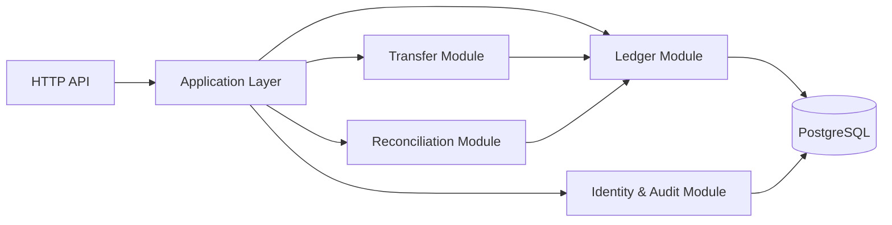
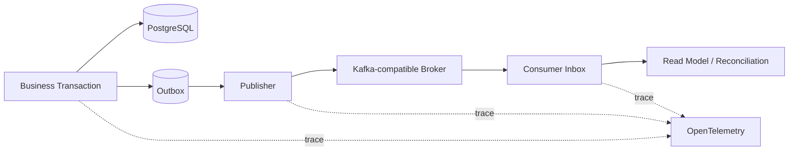
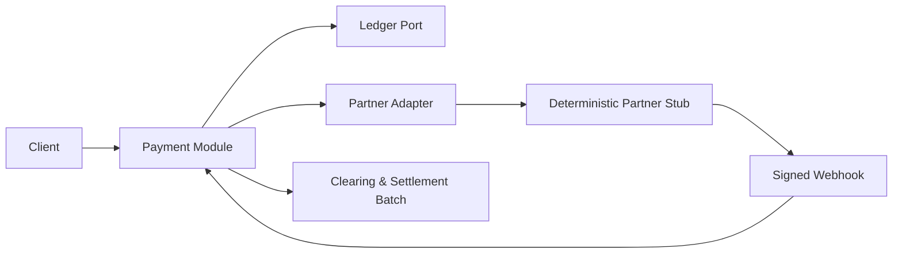
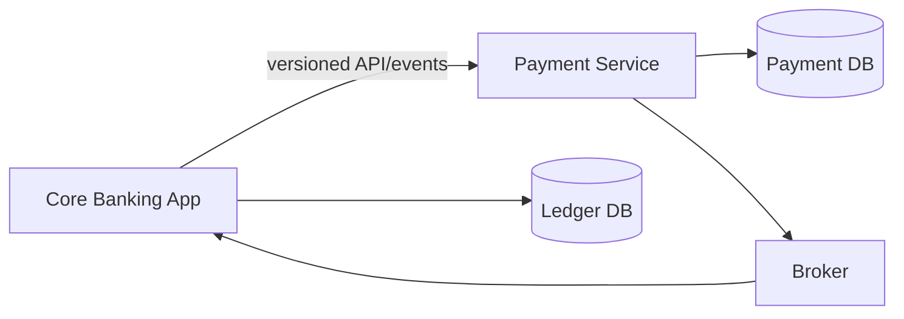
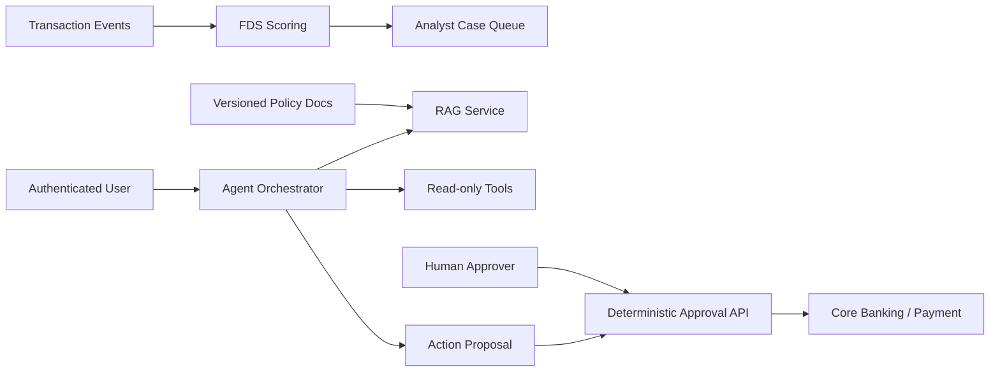

# 아키텍처 진화 계획

## 핵심 원칙

아키텍처는 미래 규모를 상상해 미리 분산하지 않습니다. 먼저 하나의 프로세스 안에서 금융 불변식과 모듈 경계를 검증하고, 경계 분리가 가져오는 이점과 비용을 프로젝트 09에서 같은 시나리오로 비교합니다.

## 단계 1 — 정합성 중심 모듈러 모놀리스

대상: 프로젝트 01~05

- 원장이 금전 기록의 source of truth입니다.
- 잔액은 원장 posting에서 계산 가능한 projection이며, 캐시·집계 값과 원장이 다르면 원장을 우선합니다.
- 이체는 원장 posting을 직접 조작하지 않고 ledger application port를 호출합니다.
- audit은 도메인 이벤트와 보안 주체 정보를 기록하지만 금전 원장 역할을 대신하지 않습니다.
- module dependency를 ArchUnit 또는 동등한 테스트로 강제할 계획입니다.

## 단계 2 — 비동기 전달과 운영 기준선

대상: 프로젝트 03~06

- outbox는 DB 변경과 이벤트 의도를 함께 저장할 뿐, 전달을 exactly-once로 만들지 않습니다.
- publisher 재실행과 consumer 중복은 의도적으로 주입합니다.
- 지표·로그·trace가 같은 correlation ID로 연결되는지 검증합니다.
- 프로젝트 06의 AWS 구조는 단일 애플리케이션 배포이며 MSA로 표현하지 않습니다.

## 단계 3 — 결제 도메인 확장

대상: 프로젝트 07~08

- 결제 상태 전이는 코드와 문서의 단일 전이표에서 관리합니다.
- 외부 파트너 stub은 지연, 중복, 오류, webhook 순서 역전을 재현합니다.
- 결제 승인과 원장 반영의 경계를 ADR로 설명합니다.
- 취소·부분 환불은 기존 posting을 삭제하지 않고 반대 posting으로 기록합니다.

## 단계 4 — 결제 서비스 분리 실험

대상: 프로젝트 09

### 분리 후보 근거

- 외부 파트너 장애와 배포 주기가 계정·원장 기능과 다릅니다.
- 결제 상태 머신은 독립된 데이터 소유권을 가질 수 있습니다.
- 파트너 트래픽 제어와 webhook 처리를 별도로 관측할 가치가 있습니다.

이는 아직 `[가정]`입니다. 프로젝트 09에서 다음을 같은 조건으로 비교합니다.

- 변경 영향 범위와 모듈 결합도
- end-to-end 지연과 실패 지점
- 로컬 실행·배포·관측 복잡도
- 데이터 정합성 복구 절차
- API·이벤트 스키마 변경 비용

분리 결과가 불리하면 다시 모듈로 합치는 결론을 허용합니다. 어느 결론이든 측정 조건과 감수한 비용을 남깁니다.

## 단계 5 — AI 보조 경계

대상: 프로젝트 10~12

- FDS 결과는 차단 결정이 아니라 분석가 검토 대상의 우선순위입니다.
- RAG는 문서 인용을 반환하며 모르는 질문을 거절할 수 있어야 합니다.
- Agent는 읽기와 변경 제안까지만 수행합니다.
- 승인 API는 Agent prompt와 분리된 인증·인가 경계를 가집니다.
- AI 서비스 장애는 원장·결제 기록을 롤백시키지 않습니다.

## 데이터 소유권

| 데이터                        | 소유자         | 다른 모듈 접근 방식               |
| ----------------------------- | -------------- | --------------------------------- |
| journal·posting               | Ledger         | application port, versioned event |
| transfer request·idempotency  | Transfer       | transfer API/event                |
| reconciliation job·difference | Reconciliation | reconciliation query              |
| identity·role·audit           | Identity/Audit | security context, audit event     |
| payment state                 | Payment        | payment API/event                 |
| FDS feature·score·case        | FDS            | asynchronous event, analyst API   |
| document chunk·evaluation     | RAG            | retrieval API                     |
| action proposal·approval      | Agent/Approval | proposal and approval APIs        |

별도 서비스가 되기 전에도 테이블 직접 접근을 금지해 논리적 소유권을 유지합니다.

## 실패와 복구 경계

- 원장 commit 실패: 전체 금전 작업 실패, 재시도는 같은 idempotency key 사용
- broker 장애: outbox에 의도 유지, 거래 commit은 보존, 전달 지연 관측
- consumer 장애: inbox와 offset을 기준으로 중복 안전 재처리
- partner 장애: payment state를 불명확 상태로 두고 조회·대사로 확정
- FDS 장애: 거래는 기록하되 미평가 상태를 적재하고 복구 후 재평가
- RAG/model 장애: 근거 없는 응답을 만들지 않고 명시적 unavailable 반환
- Agent 장애: 제안은 실행되지 않으며 승인 API는 만료·버전을 재검증

## 아키텍처 문서 정합성 규칙

- 다이어그램의 모든 구성요소는 코드·배포·설정 중 하나에서 확인 가능해야 합니다.
- 계획 요소는 점선 또는 `[가정]`으로 표시합니다.
- 사용하지 않은 기술 로고를 넣지 않습니다.
- 서비스 분리 전후 다이어그램을 함께 보관하며 현재 구조를 명시합니다.
- 최종 감사에서 다이어그램 노드와 실제 실행 단위를 전수 대조합니다.
