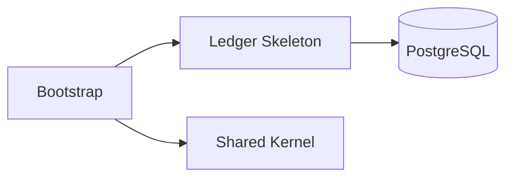
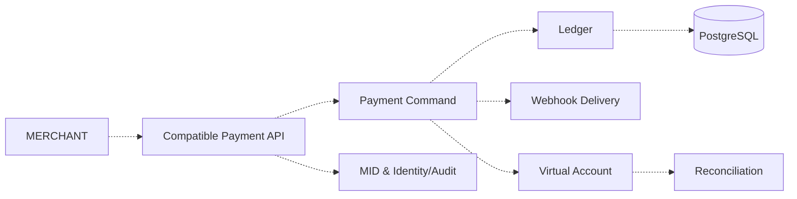
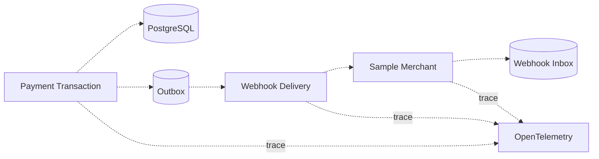
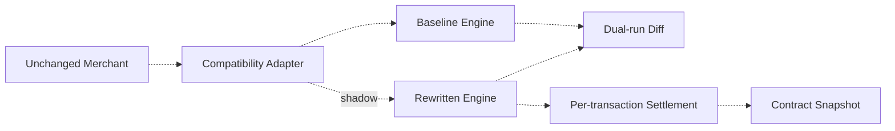
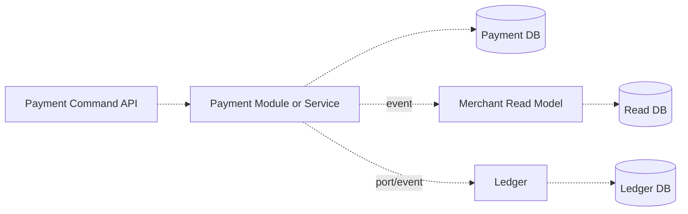
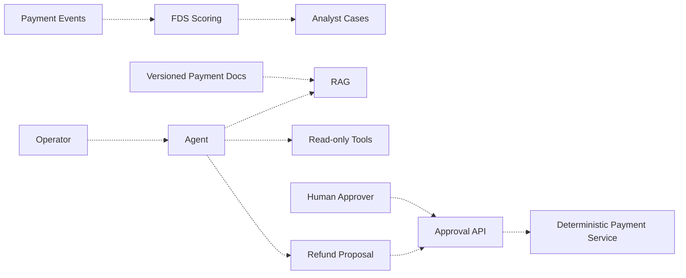

# 아키텍처 진화 계획

## 표기와 핵심 원칙

- 실선 노드: 현재 저장소에서 코드 또는 실행 설정으로 확인되는 구성요소
- 점선 노드: 계획된 구성요소
- 외부 계약은 토스페이먼츠 V2 선정 표면을 따르고 내부 구조는 자체 설계합니다.
- 하나의 프로세스에서 경계를 검증한 뒤 프로젝트 09에서만 분리 비용을 비교합니다.

## 현재 — 하네스와 원장 골격

현재 구현은 `Money`, account migration·JPA smoke test와 공통 하네스입니다. 아래 단계는 모두 `[가정]`이며 구현 뒤 실선으로 승격합니다.

## 단계 1 — 계약 중심 모듈러 모놀리스

대상: 프로젝트 01~05

- 공개 API DTO와 내부 aggregate를 분리합니다.
- Payment와 Cancel의 외부 상태를 내부 operation·journal과 명시적으로 매핑합니다.
- MID가 API key, Payment, webhook endpoint와 조회 범위의 tenant 경계입니다.
- 샘플 상점은 실제 가맹점처럼 금액 검증과 webhook 중복 억제를 수행합니다.

## 단계 2 — 비동기 전달과 운영 기준선

대상: 프로젝트 03~06

- 공개 webhook은 10초 ack와 최대 7회 재전송 schedule을 fake clock으로 검증합니다.
- outbox는 발행 의도를 보존하지만 exactly-once를 주장하지 않습니다.
- 결제 응답 유실, webhook 실패, 가상계좌 입금 지연을 서로 다른 상태로 관측합니다.
- 프로젝트 06은 단일 애플리케이션 배포이며 MSA가 아닙니다.

## 단계 3 — 호환 개편과 정산

대상: 프로젝트 07~08

- 같은 공개 fixture를 baseline과 rewritten engine에 입력해 응답·상태·journal 차이를 비교합니다.
- shadow 결과는 외부 응답이나 금전을 변경하지 않습니다.
- 정산은 거래 단위 결과와 당시 수수료 정책 snapshot을 보존합니다.
- rollback은 애플리케이션뿐 아니라 미처리 event와 데이터 전환 상태까지 포함합니다.

## 단계 4 — 조회 모델과 서비스 경계 실험

대상: 프로젝트 09

- command source와 read model을 먼저 분리하고 이벤트 중복·보정·재구축을 검증합니다.
- payment process 분리는 같은 use case·fault schedule로 모듈 기준선과 비교합니다.
- 공유 table 접근은 금지하며 pending·difference를 숨기지 않습니다.
- 비용이 이점보다 크면 모듈 상태로 원복하는 결론을 허용합니다.

## 단계 5 — 결제 운영 AI 보조 경계

대상: 프로젝트 10~12

- FDS는 자동 차단하지 않고 검토 우선순위만 제공합니다.
- RAG는 버전 고정 공식 문서와 합성 운영 정책의 인용·거절을 분리 평가합니다.
- Agent는 READ·PROPOSE만 가지며 APPROVE·EXECUTE credential을 갖지 않습니다.
- AI 장애는 결제·원장 기록을 롤백하지 않습니다.

## 데이터 소유권

| 데이터 | 소유자 | 다른 모듈의 접근 |
| --- | --- | --- |
| journal·posting | Ledger | application port, versioned event |
| payment·operation·idempotency | Payment | compatible API, payment event |
| webhook subscription·delivery | Webhook | application port, delivery query |
| virtual account·deposit | Virtual Account | payment port, deposit event |
| reconciliation·difference | Reconciliation | query API |
| merchant·MID·key·audit | Identity/Audit | security context, audit event |
| settlement item·policy snapshot | Settlement | settlement query/event |
| read projection | Read Model | event rebuild, query API |
| FDS case, RAG document, proposal | 각 AI 경계 | 비동기 event 또는 명시적 API |

## 실패와 복구 경계

- 승인 timeout·응답 유실: 임의 확정하지 않고 같은 식별자로 조회·재시도
- 원장 commit 실패: 결제 금전 결과도 함께 실패하거나 명시적 pending으로 남김
- webhook 실패: delivery 상태와 schedule을 보존하고 가맹점은 중복 안전 처리
- 가상계좌 callback 지연: 발급 상태와 입금 완료를 분리하고 조회·대사로 확인
- 정산 batch 실패: 거래별 상태에서 실패 건만 재처리
- read model 장애: command 원본은 보존하고 projection을 재구축
- AI 장애: 미평가·unavailable·미실행 proposal로 남기고 금전 변경을 만들지 않음

## 정합성 규칙

- 계획 노드는 구현 전까지 점선으로 유지합니다.
- 다이어그램 노드는 코드·배포·설정 중 하나에서 확인된 뒤에만 실선으로 바꿉니다.
- 계약 매트릭스, 실제 OpenAPI, DTO fixture와 contract test를 같은 변경에서 갱신합니다.
- 최종 감사에서 현재 diagram의 process·database·queue와 실행 구성을 전수 대조합니다.
